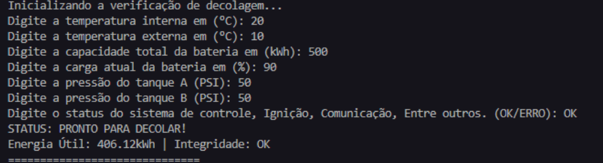

#  Sistema de Telemetria e Verificação de Decolagem

Este projeto é um simulador de controle de missão desenvolvido em **Python** para a atividade integradora da **FIAP**. O objetivo é analisar dados de telemetria em tempo real (temperatura, pressão, energia e sistemas críticos) para autorizar ou abortar a decolagem de uma aeronave/foguete com base em protocolos de segurança e integridade estrutural.

---

##  Funcionalidades e Regras de Negócio

O sistema realiza o processamento de dados brutos para gerar indicadores inteligentes de decisão:

* **Análise de Estresse Térmico:** Calcula o diferencial entre a temperatura interna e externa ($\Delta T$). Se a variação for superior a 60°C, a integridade estrutural é automaticamente comprometida.
* **Gestão Energética Realista:** Calcula a energia útil disponível aplicando um fator de eficiência que varia conforme o clima externo (perda de eficiência em temperaturas extremas).
* **Monitoramento de Pressão:** Verifica a estabilidade individual dos tanques e a simetria de pressão entre eles para evitar empuxo desigual.
* **Checklist de Módulos Críticos:** Validação de prontidão dos sistemas de controle, ignição e comunicação.

---

##  Parâmetros de Segurança (Limites Críticos)

| Parâmetro | Faixa Segura / Condição |
| :--- | :--- |
| **Pressão dos Tanques** | Entre 45 e 55 PSI |
| **Diferencial de Pressão** | Máximo de 5 PSI entre Tanque A e B |
| **Diferencial Térmico ($\Delta T$)** | Máximo de 60°C |
| **Energia Útil** | Deve ser $\ge$ ao Consumo Estimado |
| **Status de Módulos** | Deve retornar "OK" |

---

##  Fluxograma do Algoritmo

Abaixo está a representação visual da lógica de decisão do sistema, desenhada no Miro.

---

## Exemplos

### Exemplo 1: Decolagem Autorizada (Sucesso)
Neste cenário, todos os parâmetros estão dentro das faixas seguras.

### Exemplo 2: Decolagem Abortada (Falha)
Neste cenário, inserimos valores propositalmente errados (como pressão alta ou baixo nível de energia) para testar o sistema de segurança.

---

## 📝 Estrutura do Código

O script utiliza uma arquitetura de **Processamento em Lote**:
1.  **Entrada:** Captura manual de dados via `input()` com conversão para `float`.
2.  **Processo:** Cálculos de física aplicada (Termodinâmica e Pressão) e definições de variáveis dependentes (Integridade).
3.  **Decisão:** Lógica em cascata que valida cada requisito de segurança.
4.  **Saída:** Dashboard visual no console com mensagens claras de status.

---

## 🧑‍💻 Autor
  [Link para seu Perfil no GitHub](https://github.com/x864dev)]
* **Instituição:** FIAP (Atividade Integradora)

---
**Referências:**
* NASA Systems Engineering Handbook.
* Documentação Oficial Python 3.12.
* ISO 5807 (Simbologia de Fluxogramas).
